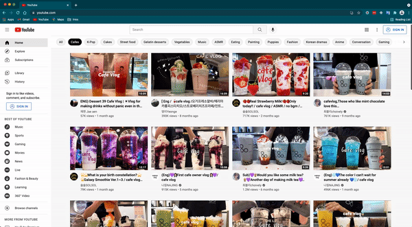

# extension_repeat
Outsourcing repetitive tasks to machines, we can spend time on creativity and innovation. This repository shows how browser extensions can take over certain repetitive tasks and free our minds from the tedious routine.



## Scenario
I came up with this extension to help me with my work. One of my daily tasks is to verify that our clients' websites conform to certain HTML formats. The scope of this task is enormous, but the step is simple. At least too simple for me to invest that much time. So I decided to outsource this work.

## How this work
The extension is simple. It opens pages with different tabs and then runs an HTML check.

Let us take YouTube as an example. 
- Open first 3 pages in the new tabs using the 'getURLtest' function in contentScript.js.
```
const getURLtest = () => {
  const allResult = document.querySelectorAll('#video-title-link');
  let output = [];
  for(let i=0; i<3; i++){
    output.push(allResult[i].href)
  }
  return output;
}
```
    
- Perform an HTML check and takes the title of the first recommended video in switch.js.
- Collect all the results and then downloads the in tsv file.

## Customize
- Change the page we want to open in the contentScript.js
  - change the selectors in the document.querySelector 
  - set a more precise target using [Xpath](https://www.w3schools.com/xml/xpath_syntax.asp) in coordination with the [document.evaluated](https://developer.mozilla.org/en-US/docs/Web/API/Document/evaluate) function.
- Assign the task we want to complete in Switch.js
  - Change the function inside [setTimeout](https://developer.mozilla.org/en-US/docs/Web/API/setTimeout). 
    The existence of setTimeout is important because many pages may be involved in the workflow.A pause between each action can lighten the load on the browser.
    
## To update the unpacked extensions:
Click on the extension's reload button. <br/><br/>
 
